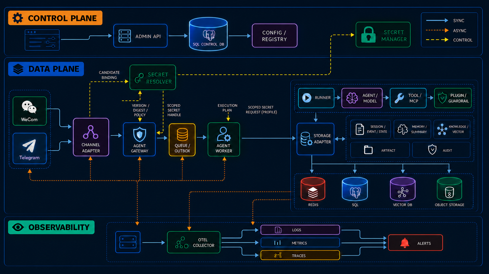
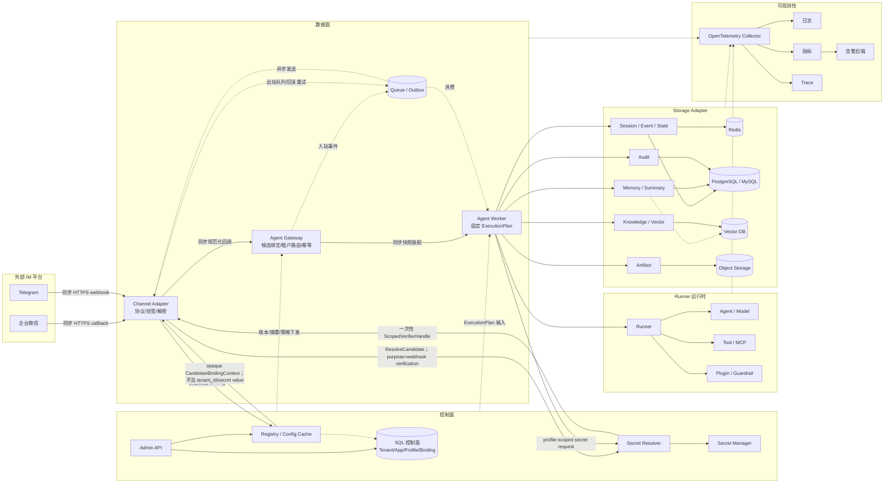
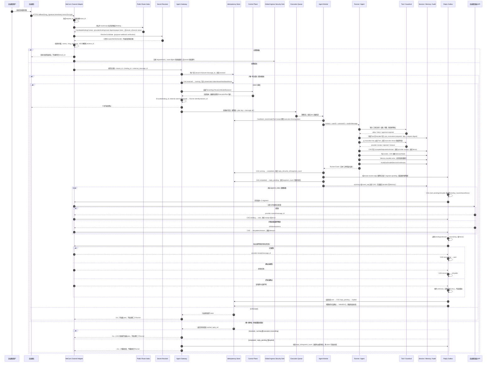

# 生产架构设计

> 本页完成 Issue #24 的生产架构设计闭环。它定义后续 Channel Binding、Gateway、
> IM Adapter 和持久化 Adapter 的边界，但不把这些设计目标误写成已经存在的生产代码。

## 阅读约定与设计结论

文中的状态标记有明确含义：

- **现有实现**：当前仓库已经有领域模型、测试或最小运行时代码支撑，例如 Tenant、Agent
  App/Revision、Model Profile、Backend Profile、Secret Resolver 接口、Execution Plan 和
  最小 tRPC-Agent-Go Runner/Session 作用域。
- **可复用能力**：直接依赖 tRPC-Agent-Go 的 Runner、Agent、Tool/MCP、Session、Memory、
  Knowledge、Artifact、Plugin/Guardrail、OpenTelemetry 或 OpenClaw Channel 边界；上游
  能力存在不代表平台已经接入真实 provider。
- **平台新增**：本平台必须实现的租户路由、控制面、绑定、幂等、队列、策略、审计和真实
  Adapter。Issue #24 只交付设计，不实现这些模块。

本方案的核心结论是：Channel Adapter 只负责协议适配和可信入站证明，Gateway 负责租户和
应用路由，Worker 负责一次固定快照的执行，Storage Adapter 负责显式租户分区；四者不能
重复实现验签、去重或重试。Worker 可以无状态水平扩展，但 Session 的顺序和并发正确性必须
由共享后端提供，sticky session 只能作为性能优化，不能作为授权或一致性的前提。

## 1. 控制面与数据面

控制面保存租户、Agent App、不可变 Revision、Model Profile、Backend Profile、Channel
Binding 和发布策略。Admin API 只接受带有 `tenant_id + object_id` 的管理操作，完成状态门禁、
乐观锁、审计和 Outbox；它不执行用户消息，也不把草稿配置直接传给 Worker。

数据面接收已验证的外部消息并创建一次执行。它从控制面读取 Tenant、当前发布 Revision、
Model Profile 和 Backend Profile，构造一个带版本、摘要和租户边界的 `ExecutionPlan`，之后
只使用这个 plan，不能在同一次执行中重新读取“当前配置”。配置更新、暂停或回滚只影响新
执行；已经接受的执行按取消和收尾策略结束。

### 组件职责与调用方向

| 组件 | 主要职责 | 调用方向 | 状态 |
| --- | --- | --- | --- |
| Admin API | 租户、App、Profile、Binding 的管理、发布、回滚、审计入口 | Admin API → 控制面 Repository | 控制面模型已实现；HTTP API 为平台新增 |
| Config/Registry | 版本校验、同租户引用、Factory/Storage 注册和缓存失效 | 控制面 → Gateway/Worker 快照 | Registry/快照边界已有；分布式缓存为平台新增 |
| Secret Resolver | 公开入站用不含 `tenant_id` 的 `CandidateBindingContext` 返回一次性验签 handle；验签后按固定 Tenant/Profile 作用域解析执行 Secret | Adapter/Gateway → Resolver；Resolver 不反向选租户 | Resolver 接口已有；candidate-scoped API、KMS/Secret Manager 为平台新增 |
| Channel Adapter | 解析供应商回调、校验协议、验签/解密、转换统一消息和出站回复 | IM ↔ Adapter ↔ Gateway | 包占位；真实 WeCom/Telegram Adapter 为平台新增 |
| Agent Gateway | 限流、候选绑定路由、可信租户建立、幂等记录、快照装配和队列投递 | Adapter → Gateway → Worker/Queue | 平台新增 |
| Agent Worker | 消费固定执行计划，调用 Runner、Model、Tool 和 Storage，生成回复事件 | Gateway/Queue → Worker → 上游能力 | 最小 Runner spine 已有；服务化 Worker 为平台新增 |
| Runner/Agent/Model | Agent 编排、模型调用、Tool/MCP、Event 和 context 取消 | Worker → tRPC-Agent-Go | 直接复用；当前已有最小 LLMAgent/Runner 装配 |
| Plugin/Guardrail/Callback | 输入、工具、输出治理和生命周期回调 | Worker → 策略链 → Runner/Tool/Storage | 上游能力可复用；租户策略编排为平台新增 |
| Storage Adapter | Session、Event、State、Summary、Memory、Knowledge、Artifact、Audit 的租户分区 | Worker → Storage Adapter → provider | Profile/Catalog 输入边界已有；真实 Adapter 为平台新增 |
| Queue/Outbox | 入站执行、回复发送、缓存回复和死信的可靠异步交付 | Gateway/Storage → Queue → Worker/Adapter | 平台新增 |
| Telemetry Collector | trace、metric、log 的导出和采样；不替代合规审计 | 所有组件 → OTel Collector | 上游/标准能力可复用；租户成本聚合为平台新增 |

调用方向必须满足三条约束：控制面只能向数据面下发固定快照，数据面不能让用户输入反向
选择其他租户；Channel Adapter 将协议错误和身份字段规范化后交给 Gateway，不能绕过
Gateway 直接调用 Runner；Worker 只能拿到已经授权的 Adapter/Factory，不枚举跨租户配置表。

## 2. 系统架构与部署拓扑

下面是面向读者的生产架构总览图。图片中的实线表示同步调用，点线表示事件/队列，虚线表示
控制面下发；图片由 `gpt-image-2` 生成并作为文档资产提交。



下面的 Mermaid 是同一拓扑的结构化备份，便于检索组件和在后续实现中增量维护。Mermaid 由
MkDocs `superfences` 和页面初始化脚本渲染。



### 最小可运行部署

开发和集成环境可以把 Admin API、Gateway、Channel Adapter 和 Worker 放在一个进程，使用
PostgreSQL 保存控制面和审计，Redis 保存幂等/队列/Session，Secret Manager 使用受控的
开发替身。即使组件同进程，也要保留上述接口和租户边界；InMemory 只用于单进程测试，不能
宣称跨节点一致性。

### Kubernetes 生产拓扑

生产环境把 Gateway、Worker、Channel Adapter 和 Admin API 分别部署为可独立伸缩的
Deployment。Gateway 通过公有 Ingress 接收回调，Channel Adapter 可以与 Gateway 同 Pod
以降低回调延迟，也可以独立部署；二者之间只传递规范化消息。Worker 只从队列和内部服务
网络接收任务，按租户并发额度和全局容量伸缩。Redis 使用高可用部署，SQL 使用主库写入和
只读副本（若副本延迟会影响会话读取则不能切读），向量库和对象存储按 provider 的可用性
模型部署。OTel Collector 使用 DaemonSet/Deployment 组合，并把日志、指标、trace 和告警
后端放在数据面之外。

发布时先扩容新版本、执行健康检查和小租户灰度，再切换 Binding 或租户路由。控制面和数据面
都要有 readiness：未加载所需 Registry、Queue 或 Secret capability 时不能接收新流量；关闭
时先摘除 Gateway，再停止消费新任务，等待有界的 Runner Event 排空和回复 Outbox 收尾。

## 3. 无状态 Worker、快照与水平扩展

Worker 不在本地内存保存会话真相。每次消息进入 Gateway 后，按可信 `tenant_id` 读取：

1. active Tenant；
2. active Agent App 的 published Revision；
3. Revision 引用的 active Model Profile；
4. Tenant 默认的 active Backend Profile。

这些对象通过现有 `runtime.ExecutionPlan` 固定 Tenant/App Revision/Model Profile/Backend
Profile 的 version 和 content digest。其 Factory/Storage 输入只包含引用和无密钥配置，
Secret 值、live client 和连接池不得进入 plan、cache key、日志或 trace。当前代码已经实现
快照校验、防御性复制、Factory cache key、Secret Resolver 边界和 Tenant-scoped Session
包装；真实分布式缓存失效仍是平台新增工作。

缓存键至少包含：

```text
tenant_id + tenant_version
  + app_id + app_version + revision + agent_content_digest
  + model_profile_id + model_profile_version + model_content_digest
  + backend_profile_id + backend_profile_version + backend_content_digest
```

发布、回滚、暂停和 Secret rotation 都产生版本失效事件。缓存命中只复用相同摘要的无密钥
Factory 或已授权的连接能力；Secret rotation 不能只依赖 TTL，应撤销旧 handle 并主动失效。
租户灰度以 `tenant_id`、Binding 或路由环为粒度，选择结果写入执行开始时的 plan，不能让一次
执行在灰度中途跨版本。

不需要 sticky session 的条件是：Session/Event/State 的真相在共享后端；同一 Session 的
写入有 CAS、事务或等价原子脚本；消费和回复都有幂等键；Memory/向量索引的最终一致性不
会被当成权限判断；Worker 可在重试时重建同一 plan。sticky session 可以减少远程读和锁竞争，
但节点失效后仍必须由共享状态恢复；如果状态只在本地内存，则它只能是开发模式，不能称为
生产水平扩展。

## 4. Channel Binding 与可信入站路由

Issue #26 的可执行领域契约、状态转移、PostgreSQL 复合键和离线验证矩阵见
[Channel Binding 与可信入站路由](channel-binding.md)。本节保留生产架构中的组件职责和
Gateway 映射，代码阶段只实现文档所列的控制面与可信边界，不实现真实供应商 Adapter。

Channel Binding 是外部账号到同一租户 Agent App 的稳定控制面对象，建议包含：

| 字段 | 语义与约束 |
| --- | --- |
| `tenant_id`、`binding_id` | 不可变身份；主键为 `(tenant_id, binding_id)` |
| `channel`、`provider_account_id` | `wecom`/`telegram` 等协议和外部账号的规范身份 |
| `public_route_key_digest` | 公开 URL 中的不可逆路由索引；只能发现候选绑定，不是授权凭据 |
| `app_id` | 同租户 App 引用；入站不能由 payload 覆盖 |
| `secret_ref` | Secret Manager 引用；不保存 secret 值 |
| `status`、`version`、`config_digest` | draft/active/suspended/disabled 生命周期和并发更新 |
| `created_at`、`updated_at` | 控制面审计和失效依据 |

Admin 操作必须显式传 `tenant_id + binding_id`，并验证 Binding、App、Secret ref 都属于该
租户。入站请求只能以公开账号、corp 标识或受控 route key 查找候选 Binding；候选查找返回
不含 `tenant_id` 或 Secret 值的 `CandidateBindingContext`，不能直接写入请求上下文。Adapter
把该 context 交给 `ResolveCandidate`，由 Resolver 在候选索引内绑定用途和短时 token，返回
一次性验签/解密 handle；再用供应商的 token/signature、时间戳、nonce、密文和 receive ID
完成验签/解密。只有验签成功后才生成可信 `tenant_id`，再创建
`tenant + channel + message_id` 幂等键；执行阶段才调用现有 Tenant-scoped `Resolve`。

默认安全策略是不允许同一个供应商账号跨租户复用：同一 `channel + provider_account_id`
的 active Binding 只能属于一个 Tenant；同租户也不能有两个 active Binding 竞争同一外部
账号。PostgreSQL 用显式列和部分唯一索引表达该约束，不能只依赖字符串前缀。若未来确实
需要共享账号，必须新增一个经过审核的“共享 Binding”模型，由控制面显式列出允许的租户，
不能把普通 Binding 的唯一性放宽后再猜测归属。

外部身份映射不使用昵称、邮箱或可变显示名：

- 单聊 `external_user_id` 使用供应商稳定 ID；平台先以结构化/长度前缀编码构造
  `binding_scoped_user = Encode(binding_id, external_user_id)`，再把它交给
  `tenant.NewRunnerIdentity`，使 Runner 的 `userID` 和持久化查询都保留 Tenant 与 Binding 边界。
- 群聊的 `external_chat_id` 必须进入 `external_session_id`；同一用户在不同群中得到不同
  Session。
- 线程/话题再加入 `external_thread_id`；没有线程能力的通道使用空值但不伪造固定线程。
- 内部 identity 的映射保存 `binding_id`、channel、外部 user/chat/thread 原值的加密或
  脱敏引用；`binding_scoped_session = Encode(binding_id, external_session_id)` 后才调用现有
  `tenant.NewRunnerIdentity(tenant_id, binding_scoped_user, binding_scoped_session)`。跨 Binding
  和跨 Tenant 永不复用 Runner UserID/SessionID。

### 企业微信与 Telegram 协议取舍

| 能力 | 企业微信 | Telegram Bot API |
| --- | --- | --- |
| 入站 | HTTPS GET 验证 URL，POST XML（常见应用回调为加密 XML） | HTTPS webhook，JSON `Update`；也可 long polling，二者互斥 |
| 验签/认证 | `msg_signature = sha1(sort(token,timestamp,nonce,Encrypt))`，通过后用 `EncodingAESKey` 解密并校验 receive ID；Token/AES key 仅由 Secret Resolver 提供 | `setWebhook` 可设置 `secret_token` 请求头，也可用不可猜的 secret path；Bot token 仅用于出站 API |
| 入站时限 | 回调处理应在 5 秒内返回；超时/非成功响应会触发重试，因此长执行必须先确认并异步处理 | webhook 应快速返回；平台失败重投递，适配器不能把 Bot API 调用结果当作 webhook 响应结果 |
| 顺序与去重 | 外部消息 ID 与重试行为需由 Adapter 统一归一，不能假定回调只到一次 | `update_id` 单调递增且可用于去重/恢复顺序；更新在服务端最多保留 24 小时 |
| 回复与流式 | 被动回复受回调时限约束；推荐回复队列、分段、卡片/主动发送和失败重试，不把 Runner 流直接暴露给 webhook | `sendMessage` 文本上限 4096 字符；可用编辑消息或支持的 draft/rich 能力模拟增量，但必须受频率限制和能力探测控制 |
| 媒体、撤回 | 文本、图片、文件、事件和撤回由 Adapter 转成统一 capability；媒体先落 Artifact 再异步处理 | Bot API 有独立媒体方法和 file API；消息编辑/删除受时间和权限约束，不能把撤回当成通用事务 |
| 频率与失败 | 以企业微信对应 API/应用配额为运行时配置，429/5xx 进入退避队列 | 解析 API 返回的 `retry_after`/限流错误并按 chat/bot 分桶退避，不能用固定全局速率假设 |

协议字段和限制可能随供应商版本变化，Adapter 应保存 `capability_version` 并以官方文档和
集成测试为准：[企业微信回调与加解密说明](https://open.work.weixin.qq.com/api/doc/90001/90143/91116)、
[Telegram Bot API](https://core.telegram.org/bots/api)。tRPC-Agent-Go 的 OpenClaw Channel
模型可以复用消息/回复抽象；验签、租户绑定、幂等和供应商退避仍属于平台新增边界。

## 5. 企业微信核心消息时序

`request_id` 在 Gateway 入口生成或沿用受信的上游关联值；`trace_id` 来自入口 trace，不
存在时由 Telemetry 生成。`external_message_id` 原样保存但脱敏展示，`idempotency_key`
只在验签成功并建立可信 Tenant 后按
`hash(tenant_id || binding_id || channel || external_message_id)` 计算。Secret 值永远不
进入以下任何 ID、事件、日志或错误。

验签失败时不能调用租户级 Session、Memory 或 Audit Adapter。Adapter 可以把
`request_id`、`trace_id`、候选 route digest、时间窗结果和失败类别写入不带租户授权语义的
全局入口安全 sink，用于检测伪造和重放；只有验签成功后，Tenant-scoped Audit 才能记录租户
级事件。全局 sink 也不得保存 Secret 或未经必要脱敏的回调正文。



回调重复与队列任务重投递必须分开处理：Gateway 对 `running` 或 `execution-reconciling` 的重复回调只返回 2xx，不启动
第二个 Runner；只有 execution lease 过期后，Queue/Worker 才能用新的 owner、claim token 和
fencing token 进入 `execution-reconciling`。修复器检查最后 event、Tool 外部幂等键和 provider
receipt；已经提交的 Tool 不重跑，结果不明的外部副作用进入 failed/DLQ/人工处理，只有安全可
恢复的任务才重新排队。旧 Worker 的 heartbeat、event/state、Tool receipt 和 outbox 写入必须
因 fence 不匹配而被拒绝。

任何可能产生外部副作用的 Tool 都必须先持久化 `tool_invocation` 的 `prepared` 记录，包含
`invocation_id`、外部幂等键、request digest、Tool capability digest 和待调用引用，再以当前
execution fence 进入 `dispatching`。供应商回执或超时分别落为 `accepted`/`rejected` 或
`unknown`；租约回收先进入 `reconciling` 并按原幂等键查询。已接受不重跑，确认未接受且工具
声明安全幂等时才回到 `prepared`，结果不明或没有供应商幂等能力则进入 `manual`/DLQ，不能
自动重放副作用。

`completed` 表示执行结果、`reply_id`、`reply_cache_ref` 和 `segment_count` 已持久化，但还不是可发送
状态。Worker 必须先以 tenant+event+reply 关联和幂等键物化完整 `reply_outbox` 分段，再把
`completed` CAS 为 `reply_pending`；同一 provider 使用事务，跨 provider 则使用 durable repair
marker。若 Worker 在两步之间崩溃，行保持 `completed`，修复器根据 event 上的 `reply_cache_ref` 和
`segment_count` 补齐分段并再次 CAS；任何 `reply_pending` 行都必须能找到完整 segment_count，
否则进入 repair 而不能直接标记 `replied`。时序中 `message_event` 的唯一性和 Session 顺序由共享 Storage Adapter 保证；队列至少一次
投递不是重复执行的借口。`completed` 但回复失败时重放缓存回复，不重新调用模型或具有副作用
的 Tool；只有明确标记为安全、幂等的步骤才允许重试。回复 Outbox 还必须以
`reply_id + segment_index` 建立稳定的分段幂等记录，保存顺序、状态、attempts 和供应商回执。
每个分段发送前都要以 CAS 抢占 `owner`、`lease_expires_at` 和单调 `fencing_token`；只有持有
最新 fence 的 Worker 才能提交发送结果。Worker 崩溃后，过期的 `sending` 或 `unknown` 先进入
`reconciling`，用同一个出站幂等键向供应商查询；确认已接受才标记 `sent`，确认未接受才换
新 fence 进入 `retryable`，仍不明则保留 `unknown` 并告警/DLQ，不能直接重发。聚合消息只有在
全部分段为 `sent` 后才能进入 `replied`；请求超时但供应商结果不明时，优先使用供应商查询
或其幂等能力确认；未确认前进入 `unknown`，不能盲目重发造成重复消息。

## 6. 数据同步、顺序与幂等

### Session、Event、State、Summary 的提交规则

推荐 SQL 后端作为强一致 Session/Event 真相：对 `(tenant_id, session_id)` 行加锁或使用
`session.version` CAS，分配单调 `event_seq`，在同一事务中提交入站 event、必要的 state
变更和 Outbox。PostgreSQL/MySQL 的事务边界必须由具体 Adapter 验证；不能把 Redis、向量库
或对象存储描述成具备 SQL 事务。

Redis 后端可用 Lua/事务/Stream 在同一 keyspace 内原子分配序号和写入，但跨 key、跨集群
故障转移和持久化语义要以 provider 配置和契约测试为准。租约只用于减少同一 Session 的
并发执行，不能替代 event 唯一约束；租约丢失后，旧 Worker 必须用 fencing token 或 CAS
拒绝覆盖新版本。

写入顺序固定为：

1. 通过 `message_event` 的唯一 `(tenant_id, binding_id, external_message_id)` 记录入站
   幂等事实；
2. 抢占执行状态并追加用户 event，分配 `event_seq`；
3. Runner 事件按序写入，使用 CAS 更新 Session state；冲突时重新读取最新版本并重放未提交
   event，不覆盖他人状态；
4. Memory 先写可追溯的 durable entry，再异步建立向量索引；如果 Memory 不能提交，不能
   创建可发送的回复 outbox，必须进入补偿/repair；
5. event、state 和 Memory 成功提交后，在 `message_event` 上固定 `reply_id`、`reply_cache_ref`
   和 `segment_count`，再按 `(tenant_id, event_id, reply_id, segment_index)` 写入 `reply_outbox`；
   outbox 必须有 event 外键/关联，不能由孤立 `reply_id` 推断归属；
6. summary 记录 `base_event_seq`，在 outbox 之后从已 durable 的 event/Memory 异步重建并 CAS，
   失败则保留事件和 Memory、重排摘要任务。索引延迟只影响检索新鲜度，不影响租户授权、
   Session 顺序或审计事实。

若 event、state 和 outbox 不能在同一 provider 事务中完成，Adapter 必须使用显式 outbox、
补偿状态和可重放事件，并在文档中声明最终一致；不能以“调用顺序”冒充原子提交。

### 入站幂等状态机

```text
received ──claim/CAS──> running ──execution commit──> completed
    │                         │                             │
    │                         └─ lease expired ────────> execution-reconciling
    │                                                         │
    └─ invalid/duplicate                                   failed / DLQ

execution-reconciling ──safe repair + new fence──> running
                      └─ unsafe/unknown side effect ──> failed + DLQ

completed ──materialize outbox/CAS──> reply_pending ──send success──> replied
                                   │
                                   └─ retry budget exhausted ──> failed + DLQ
```

`running` 的执行租约过期时把 `message_event.status` 置为 `execution-reconciling`，而不是由
HTTP 回调重复路径直接启动第二个 Runner；修复成功才以新 fencing token 回到 `running`，副作用
无法对账则进入 `failed/DLQ`。旧 Worker 的 heartbeat、event/state、Tool receipt 和 outbox 写入都因
fence 不匹配而被拒绝，保证队列重投递不会覆盖新执行。

回调层在 `running` 或 `execution-reconciling` 收到重复请求时只返回确认，不再创建 Runner；这与队列任务重投递是两种
路径。只有 Worker/Queue 发现 execution lease 过期后，才能 CAS 抢占新的 owner 和 fencing
token，并先对账已提交 event、每个 Tool 的外部幂等键和 provider receipt。已确认的 Tool 不得
重跑；没有不可逆副作用且可以从最后 event 安全恢复时才重新排队，副作用结果不明则进入
failed/DLQ/人工处理。`completed` 或 `reply_pending` 时使用缓存回复引用重试出站；`replied`
直接返回已完成；模型输出不是天然幂等，扣费、发送、工单和外部写操作必须有单独的幂等键或
人工确认。对于一个有多个分段的回复，消息级状态之外还要记录
`segment_id`、`segment_index`、`segment_count`、`pending/sending/sent/retryable/unknown/failed`、
尝试次数、`provider_message_id` 和最后错误；只有所有 segment 都已确认发送，消息级状态才
能从 `reply_pending` 变为 `replied`。

### 事件与租户约束

所有表都显式保存 `tenant_id`，主键或唯一键包含租户列；`session_id`/Runner namespace 只
是防碰撞，不是授权。`message_event` 至少有 `(tenant_id, session_id, event_seq)` 和
`(tenant_id, binding_id, external_message_id)` 两组约束。乱序消息不改变已提交序号：先进入
`pending` 或按供应商序号保存，等前置事件到达；超过窗口则进入可观测的 repair/DLQ，不能
静默插入旧内容到当前 summary。

## 7. 多后端适配与迁移

| 数据责任 | InMemory | Redis | SQL（PostgreSQL/MySQL） | 向量库 | 对象存储 |
| --- | --- | --- | --- | --- | --- |
| Session/Event/State | 单进程 mutex；重启丢失 | 低延迟，需脚本/CAS/Stream | 推荐权威源；事务、CAS、审计查询 | 不适用 | 不适用 |
| Summary | 测试替身 | 可用但要声明持久化级别 | 与 event_seq 关联并 CAS | 只保存检索索引，不保存唯一真相 | 不适用 |
| Memory | 测试替身 | 快速 durable entry；索引异步 | 可追溯正文、租户约束 | 最终一致的 embedding/index | 大对象可外置 |
| Knowledge | 不适合作为生产源 | 元数据/缓存 | 文档元数据和权限 | embedding、过滤和检索 | 原始文档 |
| Artifact | 本地测试 | 不建议承载大文件 | metadata、digest、权限 | 不适用 | 内容和版本化对象 |
| Audit | 进程日志，不合规 | 临时队列 | append-only/WORM 目标 | 不适用 | 长期归档副本 |

强一致只用于需要顺序、幂等、权限和审计的控制面/Session/Event；向量索引是最终一致，
对象存储的一致性、覆盖和删除语义由具体 provider 合同决定。Backend Profile 的 provider、
capability、版本和一致性等级必须在发布时校验；一次执行固定一个 Profile，不能在同一请求
里把 Session 从 Redis 读、把 Event 写 SQL 而不留下迁移上下文。

### Redis → SQL

1. 为租户发布新的 Backend Profile 版本，冻结迁移前版本；新执行仍明确选择旧版本。
2. 按租户和 Session 分片做全量复制，复制 event、state、summary、idempotency 和 outbox，
   记录源 `event_seq`、版本和内容 digest。
3. 开启带 outbox 的双写：旧 Redis 继续服务，SQL 接收相同幂等事件；失败不能静默丢弃，
   必须进入 repair 队列并阻止切读。
4. 从 Redis Stream/变更日志按租户追平全量复制后的 cursor；通过行数、最大序号、摘要哈希、
   随机 payload 和未完成 outbox 校验。
5. Shadow read 比较指定 Session 的 event 序列和 state digest，稳定观察后把**新执行**切
   到 SQL；进行中的 plan 仍使用原 Profile。
6. 保留 Redis 只读/双写窗口。若 SQL 延迟、冲突或校验失败，回滚新执行到旧 Profile，
   修复后从 cursor 重放；不回滚已经对外发送的副作用，只通过审计和补偿处理。

### 本地向量库 → 远端向量库

先导出文档/Memory 的稳定 ID、Tenant、权限标签、原文 digest、embedding model/version 和
chunk 元数据，再按 chunk 批量导入远端。导入必须幂等，维度或 embedding model 不一致时重建
而不是强行转换；完成数量、digest、租户过滤、抽样检索和删除 tombstone 校验后，建立新的
Backend Profile/Knowledge index 版本，先 shadow query 再切新执行。旧索引保留到所有旧 plan
完成，回滚只改变后续 plan 的 Profile，不改变已发出的回复或旧索引的事实。

## 8. 治理、可观测性与故障恢复

每次执行的治理顺序为：可信入站和租户状态 → Binding 与 IM 用户权限 → 固定 App/Model/Backend
快照 → 输入脱敏/内容策略 → Tool/MCP allowlist、参数 schema、预算和危险操作确认 → Model
调用 → 输出 Guardrail/脱敏 → Session/Memory/Audit/Reply Outbox。Plugin、Guardrail 和
Callbacks 可复用 tRPC-Agent-Go 的生命周期，但租户策略装配、密钥注入、审批和成本上限是
平台新增；Tool 名称或模型返回值都不能自动越过 allowlist。

审计与 telemetry 分开：审计事件至少包含 `tenant_id`、`binding_id`、`channel`、`user_id`、
`session_id`、`agent_app_id`、`revision`、`model_profile_id`、`tool_name`、`decision`、
`event_seq`、`latency`、`error_type`、`cost`、`request_id`、`trace_id` 和发生时间。审计
采用 append-only 事务、访问控制、保留期限和可选 hash chain/WORM 归档；trace 可以采样，
不能替代审计。Secret、原始 token、AES key、模型 API key、完整 webhook body 和用户敏感
内容不得进入日志、trace attributes、cache key、错误或 PR。

指标只使用受控低基数标签，例如 channel、provider、status、error_class、model_family 和
租户的授权成本维度；`message_id`、session、user 和完整 URL 放日志上下文或 trace，不放
Prometheus label。以 `tenant_id` 归集成本时须有访问控制和基数上限，异常租户用 exemplars
或审计查询定位。

故障处理遵循“有界取消、只重试安全动作、状态可重放”：

| 故障 | 处理 |
| --- | --- |
| Model 超时/限流 | 继承 `context.Context` deadline，按请求预算有限退避；超限写失败 event 并返回固定兜底，不无限重试 |
| Tool/MCP 失败 | 按 Tool capability 标记是否幂等；危险/外部副作用默认不重试，进入审批或人工补偿 |
| Redis/SQL 短暂不可用 | 读取和写入快速失败或进入 outbox；不把旧缓存当成新的授权配置，恢复后按 event cursor 重放 |
| IM 发送失败 | 只重试 reply outbox，指数退避和 jitter；过限流时间进入 DLQ，使用缓存回复避免重复模型执行 |
| Worker/节点故障 | 队列重新投递；旧 lease 失效后由 fencing/CAS 防止覆盖；启动时排空可恢复事件 |
| 取消/关闭 | 取消 Runner context，有限等待 Event channel 排空，关闭 Runner 和 owned resources；超时写 `cancelled`/`failed` 事件 |

平台必须清楚区分 borrowed 和 owned 资源：现有 Runner 借用调用方 Session service，未来
Worker 关闭时只关闭自己创建的 client/queue consumer；每个后台 goroutine 有退出 channel、
deadline 或 supervisor，不能把 `context.Context` 存成无限生命周期的全局对象。

## 9. 现有能力、平台新增与实施顺序

| 能力 | 当前仓库/上游可复用 | Issue #24 后仍需实现 |
| --- | --- | --- |
| Tenant/App/Revision/Profile 生命周期、版本和摘要 | 当前 Go 领域模型、InMemory Repository、快照测试 | SQL migration、Admin HTTP API、分布式失效 |
| Model/Secret/ExecutionPlan/Runner spine | `model`、`runtime` 包和 tRPC-Agent-Go Runner | 真实 Secret Manager、Agent Registry、Worker 服务 |
| Session 用户命名空间 | tRPC-Agent-Go Session + TenantSessionService | Redis/SQL adapter、CAS/序号、跨节点 conformance test |
| IM 消息抽象 | OpenClaw Channel 模型可作为参考 | Channel Binding、WeCom/Telegram 验签、身份映射和回复队列 |
| Tool/Memory/Knowledge/Artifact/Telemetry | tRPC-Agent-Go 对应接口和 OTel | 租户路由、统一 Storage Adapter、审计/成本和策略链 |

后续顺序保持为：

```text
Production architecture design (本页)
  └── Channel Binding + trusted inbound routing
        └── HTTP Gateway / streaming API
              └── WeCom adapter + idempotency/reply retry
                    └── persistent repositories and production adapters
```

Issue #24 的文档交付完成后，README 只勾选设计交付物；Channel Binding、Gateway、真实 IM/Storage
Adapter、KMS、迁移工具、Dashboard 和告警规则仍保持未实现状态，避免文档进度掩盖工程边界。
