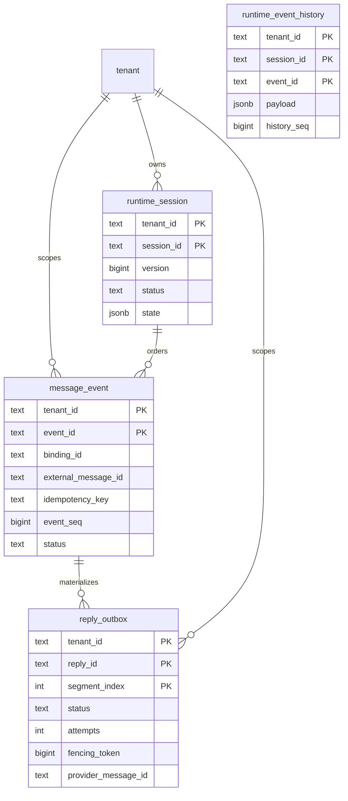

# Tenant 运行时持久化契约（Issue #48）

> 本页是 Issue #48 的先行设计与实现 ledger。它把 Session、入站事件和回复
> Outbox 的租户边界、顺序和错误契约固定下来，再由后续代码阶段逐项落地。
> 在 ledger 全部完成前，PR 使用 `Updates #48`，不会把未实现的能力描述成已交付。

## 目标与非目标

运行时持久化的事实源是 PostgreSQL。每个操作都必须显式带 `tenant_id`；
Session/Runner 使用的命名空间只用于防碰撞，不能替代数据库授权。第一阶段覆盖：

- Session 元数据、状态版本和生命周期；
- `message_event` 入站幂等事实、事件序号和执行状态；
- `reply_outbox` 分段回复、租约/fencing、重试和供应商回执。

本 Issue 不实现 Redis、Memory/Knowledge/Artifact 生产适配、AuditEvent/usage/cost、
完整 IM webhook/media、分布式调度、KMS/Vault 或告警平台。API principal 继续由
Gateway HTTP 层的进程内幂等存储保护；跨进程 durable inbound claim 只在已验证
Channel principal 上启用，因为 `message_event.binding_id` 必须引用真实的控制面 Binding。

## 数据边界和关系



约束必须由数据库和 Repository 双重保证：

- `(tenant_id, session_id, event_seq)` 唯一，事件序号单调且无跨租户共享；
- `(tenant_id, binding_id, external_message_id)` 唯一，重复入站返回已有事件；
- 事件和 Outbox 的所有外键都是带 `tenant_id` 的复合外键；
- `reply_outbox` 的 `(tenant_id, event_id, reply_id, segment_index)` 唯一，
  分段物化幂等；
- 返回的 map、slice、JSON 和时间值均为防御性副本。

## Repository 契约

平台层使用小接口，避免把 PostgreSQL 类型泄漏给 Gateway：

```go
type RuntimeStore interface {
    GetSession(ctx context.Context, tenantID, sessionID string) (Session, error)
    CreateSession(ctx context.Context, tenantID, sessionID string, state map[string]any) (Session, error)
    UpdateSessionState(ctx context.Context, tenantID, sessionID string, expectedVersion int64, state map[string]any) (Session, error)
    RecordMessage(ctx context.Context, MessageEventInput) (MessageEvent, bool, error)
    TransitionMessage(ctx context.Context, MessageTransition) (MessageEvent, error)
    AppendEventPayload(ctx context.Context, EventPayload) (EventPayload, error)
    ListEventPayloads(ctx context.Context, tenantID, sessionID string) ([]EventPayload, error)
    TransitionReply(ctx context.Context, ReplyTransition) (ReplyOutbox, error)
}
```

runtime_event_history 是 session-scoped、append-only 的完整上游 Event JSON 历史；
同一 (tenant_id, session_id, event_id) 只能以相同 payload 幂等重放，冲突 payload 被拒绝。
Session adapter 在上游 delegate 恢复后按 history_seq 增量回放，避免 fresh process 丢失事件。
具体实现还可以提供读取事件、领取 Outbox 和更新 provider receipt 的窄接口；
每个方法都要在 SQL 查询、事务、锁等待和连接获取处传递 `context.Context`。

稳定错误分类为：`ErrNotFound`、`ErrDuplicate`、`ErrConflict`、`ErrInvalid`、
`ErrIllegalTransition`、`ErrStorage`；取消和 deadline 原样保留为
`context.Canceled`/`context.DeadlineExceeded`。底层 SQL、DSN、Secret、完整消息和
供应商原始错误不得进入日志、trace 或 HTTP 错误。

## 提交顺序和状态机

一条入站消息的提交屏障固定为：

1. 以唯一键物化 `message_event` 入站事实；
2. 在 Session 行上做版本/CAS 检查并分配下一个 `event_seq`；
3. 持久化执行结果和 Session state；
4. 物化完整 `reply_outbox` 分段；
5. 异步重建 Summary（Summary 失败不能撤销前四步）。

入站状态为 `received → running → completed → reply_pending → replied`；租约过期进入
`execution_reconciling`，无法安全对账则进入 `failed`/死信。重复回调在
`running`、`completed` 或 `replied` 时只返回已有结果，不重新启动 Runner。Gateway 在
配置了 RuntimeStore 时，会在 verified Channel principal 的 Runner 调用前以
`(tenant_id, binding_id, external_message_id)` 原子 claim；已有 claim 直接返回
`ErrDuplicateMessage`，因此第二个进程不会获取 Runner。

Outbox 最小状态转换为：

```text
pending -> sending -> sent
pending -> retryable -> sending
sending -> retryable | dead_letter
```

每次领取递增 `fencing_token` 并设置 lease；只有最新 fence 的 Worker 可以提交
发送结果。非法迁移返回 `ErrIllegalTransition`，不能被静默归一化。

协议中立的 outbox worker 通过租户限定的候选快照领取 pending/retryable 或过期
sending 分段；provider 成功回执只由当前 fence 写入 `sent`，可重试错误写入
`retryable`，不可重试或超过尝试上限写入 `dead_letter`。过期 lease 先调用
provider reconciliation，`accepted` 直接确认，`rejected` 重试，`unknown`
不得伪造成功。一个 event 的全部分段确认后，worker 才推进
`completed → reply_pending → replied`。

## Bootstrap 与恢复

Bootstrap 必须显式选择 Session capability。`TRPC_SESSION_BACKEND=postgres` 时，
必须同时提供已迁移的 `TRPC_POSTGRES_DSN`；未知值、缺失 DSN 或 migration 验证失败
均 fail-closed。`inmemory` 只用于开发和测试，并在 readiness/启动日志中明确显示
非持久化。新进程连接同一 DSN 后应能读取已有 Session、事件和未发送 Outbox。
真实验收测试使用可选的 `POSTGRES_RUNTIME_TEST_DSN`，并要求该 DSN 已有可写的
`POSTGRES_RUNTIME_TEST_TENANT_ID` 与 `POSTGRES_RUNTIME_TEST_BINDING_ID`；测试会执行
完整 RuntimeStore 操作、关闭连接、重新打开连接并验证 Session/Event/History/Outbox
仍可读取。未提供这些变量时测试显式 skip，不得把 skip 记为 live PostgreSQL 证据。

## Issue ledger

| 项目 | 阶段 | 完成证据 | 状态 |
| --- | --- | --- | --- |
| 契约、表关系、状态机和提交顺序文档 | 文档 | 本页与 `data-model.md`/`ops.md` 交叉链接 | ✅ |
| InMemory/PostgreSQL RuntimeStore 接口 | 1 | Go 接口、错误分类、深拷贝测试 | ✅ |
| 有序 migration、复合 FK、唯一约束、状态约束和 Session 删除级联 | 2 | `0003_runtime_storage.up.sql`、`0004_runtime_session_delete_cascade.up.sql`、`0005_runtime_event_history.up.sql` 与 migration 测试 | ✅ |
| CAS/event_seq、重复入站和 Outbox fencing | 2 | 并发、乱序、重试、死信测试 | ✅ |
| Bootstrap 显式 Session capability 与 fail-closed | 3 | 环境配置、RuntimeStore-backed session.Service、重启恢复测试 | ✅ |
| durable Event payload/history 与完整 Event 状态生命周期 | 4 | `runtime_event_history`、fresh delegate replay、状态迁移测试 | ✅ |
| Outbox worker/reconciliation/provider delivery | 5 | fenced worker、重试/死信/过期 lease 与 provider 测试 | ✅ |
| 真实 PostgreSQL/InMemory conformance 与 fresh-process restart | 6 | `POSTGRES_RUNTIME_TEST_DSN` 可选 live suite 与 reopen 证据 | ✅* |
| verified Channel duplicate Runner suppression | 6 | RuntimeStore claim + 并发 Gateway Runner invocation-count 测试 | ✅ |
| 租户越权、取消、脱敏和防御性返回 | 1–6 | 双租户 conformance 与错误边界测试 | ✅ |
| `go test`、race、vet、build、MkDocs strict | 最终 | PR 验证记录与 CI | ✅ |

`✅*` 表示测试代码和重启路径已交付；live PostgreSQL 证据只有在 CI/本地实际
提供上述 DSN 时才可勾选，未设置 DSN 的默认测试运行会 skip。

在代码阶段完成后，本表必须与 PR 描述同步；未完成项目保留为明确的后续阶段。
